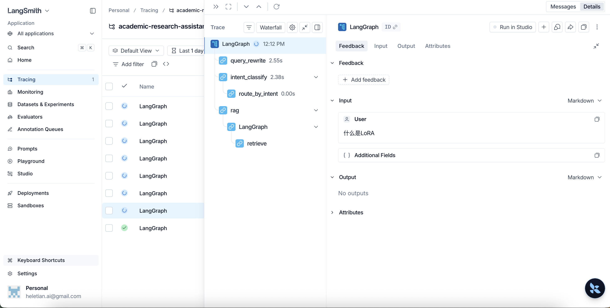
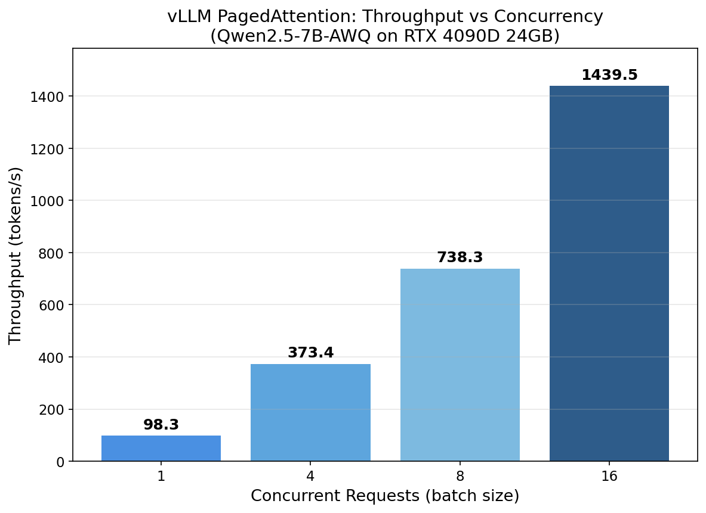
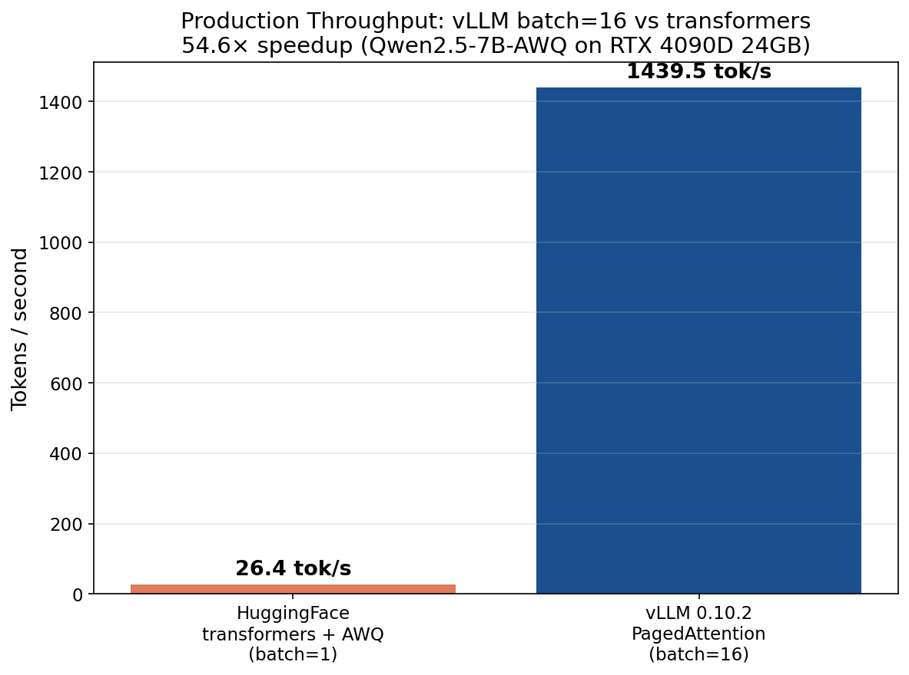

# Academic Research Assistant

RAG + Multi-Agent + MCP 学术研究智能对话系统，支持知识问答、任务执行、闲聊三种意图自动分流。

## Architecture

```
User Query
  → Query Rewrite → Intent Classification
      ├── Knowledge → [RAG Pipeline]
      │     BM25 + FAISS Hybrid Search → RRF Fusion → CrossEncoder Rerank
      │     → CRAG Grading (relevant / ambiguous / irrelevant)
      │         ├── relevant  → Generate Answer
      │         ├── ambiguous → Query Rewrite Retry (max 3)
      │         └── irrelevant → Web Search Fallback
      ├── Task → Plan-and-Execute Agent
      │     Plan → Human Confirm → Tool Execute ↔ Reflexion → Synthesize
      │     MCP Servers: ArXiv / Semantic Scholar / Notes (9 tools)
      └── Chitchat → Direct Response
```

## Key Features

- **Hybrid Search + Rerank**: BM25 + FAISS vector dual retrieval, RRF (k=60) fusion, CrossEncoder (ms-marco-MiniLM) reranking top-3
- **CRAG Self-Correction**: Three-level degradation strategy to eliminate hallucination on retrieval failure
- **Agent + Reflexion**: Plan-and-Execute with Reflexion self-correction (tool failure → root cause analysis → replan, max 2 rounds)
- **MCP Integration**: ArXiv / Semantic Scholar / Notes — 3 MCP Servers, 9 tools
- **LangGraph Orchestration**: State graph + SQLite Checkpointer for checkpoint recovery

## Evaluation Results

### Retrieval (4-group ablation, 30 test queries)

| Method | Hit@3 | Hit@5 | MRR |
|--------|-------|-------|-----|
| BM25 Only | 93.3% | 100.0% | 0.737 |
| Vector Only | 83.3% | 83.3% | 0.775 |
| Hybrid (RRF) | 90.0% | 96.7% | 0.819 |
| **Hybrid + Reranker** | **93.3%** | **93.3%** | **0.917** |

### Generation Quality (3-tier evaluation system, 100 test queries)

**Tier 1 — LLM-as-Judge** (legacy)
- Faithfulness + Relevancy 2 维 baseline 评分

**Tier 2 — RAGAs 0.4 Standard Metrics** (`tests/evaluate_ragas.py`)
- 自动 statement-level claim 拆分 → 逐条对照 retrieved context
- Faithfulness / Answer Relevancy / Context Precision 三指标
- AnswerRelevancy 用 query reconstruction + sentence-transformers embedding 余弦相似度（不仅 LLM 直接打分）

**Tier 3 — GEval CoT Multi-Sample** (`tests/evaluate_geval.py`)
- 4 维评分（Faithfulness / Relevance / Coherence / Conciseness）
- Chain-of-Thought prompt：评分前先 step-by-step 推理 + 引用 evidence
- 多次采样（n=3）取均值降方差 ~30%

跑法：
```bash
python -m tests.evaluate_retrieval   # Hit@K + MRR + 4 组 ablation
python -m tests.evaluate_ragas       # RAGAs 三指标，输出 benchmarks/ragas_results.{json,md}
python -m tests.evaluate_geval       # GEval CoT 4 维 × 3 samples
```

## Observability (LangSmith)

全链路 trace + cost / latency / error rate dashboard，集成 https://smith.langchain.com。

```bash
# 在 .env 配置
LANGSMITH_TRACING=true
LANGSMITH_API_KEY=lsv2_pt_xxxx
LANGSMITH_PROJECT=academic-research-assistant
```

启用后每次 query 自动上传完整 graph trace（5 层调用：query_rewrite → intent_classify → rag → retrieve → generate）。截图见 [docs/screenshots/langsmith/](docs/screenshots/langsmith/)。



## LLM Provider Switching

`.env` 设 `LLM_PROVIDER` 在两个 provider 间切换（embeddings 始终用 OpenRouter，因为 FAISS index 已构建好）：

| Provider | Chat Model | 价格 | Embedding |
|---|---|---|---|
| zhipu (默认) | `glm-4-flash` | **完全免费** | OpenRouter `text-embedding-3-small` |
| openrouter | `deepseek/deepseek-chat` | ~$0.10/M token | OpenRouter `text-embedding-3-small` |

## Tech Stack

- **Framework**: LangGraph 1.x, LangChain 1.x
- **LLM**: Zhipu GLM-4-Flash (free) / DeepSeek (via OpenRouter), 双 provider 一键切换
- **Retrieval**: FAISS (vector), BM25 (rank_bm25), CrossEncoder (ms-marco-MiniLM-L-6-v2)
- **Evaluation**: 3-tier (LLM-as-Judge / RAGAs 0.4 / GEval CoT) + 100 test queries
- **Observability**: LangSmith (trace + cost / latency dashboard)
- **MCP**: FastMCP (3 servers, 9 tools)
- **UI**: Streamlit
- **Storage**: SQLite (checkpointer)

## 推理性能 Benchmark（vLLM 部署）

完整数据 / 脚本 / chart：[benchmarks/autodl_outputs/](benchmarks/autodl_outputs/README.md)

### 配置
- **GPU**：NVIDIA RTX 4090D 24GB（Ada SM_89）
- **模型**：Qwen2.5-7B-Instruct-AWQ（4bit 量化）
- **后端**：vLLM 0.10.2 PagedAttention + awq_marlin kernel
- **对照**：HuggingFace transformers 4.51.3 + autoawq 0.2.9

### 关键数据

| 引擎 | 配置 | 吞吐量 | 显存 |
|---|---|---|---|
| HF transformers + AWQ | batch=1 | 26.38 tok/s | 5.24 GB |
| vLLM + AWQ-Marlin | batch=1 | **98.59 tok/s** (P50) | 21.13 GB |
| vLLM + AWQ-Marlin | batch=16 | **1439.47 tok/s** | 21.13 GB |

**vLLM batch=16 vs HF transformers：54.6x 加速**

### Charts





### 部署说明

```bash
# 环境：AutoDL RTX 4090D / 驱动 ≥ 550 / 镜像 PyTorch 2.5.1 + CUDA 12.4
# vLLM 0.10.2 强制 torch 2.8.0，cu124 wheel 无 2.8.0，必须切 cu128
pip install "vllm==0.10.2" --no-deps
pip install torch==2.8.0 torchvision==0.23.0 torchaudio==2.8.0 \
  --index-url https://download.pytorch.org/whl/cu128
pip install xformers==0.0.32.post1 transformers==4.51.3  # autoawq 0.2.9 兼容

# 启动 vLLM OpenAI-compatible API server
python -m vllm.entrypoints.openai.api_server \
  --model Qwen/Qwen2.5-7B-Instruct-AWQ \
  --quantization awq_marlin --dtype half \
  --max-model-len 4096 --gpu-memory-utilization 0.85 \
  --enforce-eager
```

完整部署命令 / 依赖陷阱 / 4 道验证关卡：[benchmarks/autodl_outputs/README.md](benchmarks/autodl_outputs/README.md)

### 选型决策

曾尝试 RTX PRO 6000 Blackwell SM_120 失败 — vLLM 0.10.2 的 AWQ Marlin kernel 未编译该架构，GPU 0% / CPU fallback 0.1 tok/s。教训：选 GPU 不只看显存，软件栈兼容性同等重要。最终选 4090D Ada SM_89 — vLLM AWQ kernel 完整支持 + 价格 1/3。

## Quick Start

```bash
# Install dependencies
pip install -r requirements.txt

# Set API key in config/settings.py

# Run the app
streamlit run ui/app.py
```

## Project Structure

```
├── main.py              # Entry point, build main graph
├── graph/               # LangGraph state & nodes
│   ├── state.py         # Graph state definition (incl. Reflexion fields)
│   ├── nodes.py         # Node functions (rewrite, classify, generate, reflexion...)
│   ├── rag_subgraph.py  # RAG sub-graph builder
│   └── builder.py       # Main graph builder with routing
├── rag/                 # RAG components
│   ├── retriever.py     # BM25 + FAISS hybrid retrieval + RRF fusion
│   ├── reranker.py      # CrossEncoder reranker
│   ├── grader.py        # CRAG document grader
│   └── document_loader.py
├── agent/               # Agent components
│   ├── planner.py       # Plan-and-Execute planner
│   └── tool_executor.py # MCP tool executor
├── mcp_tools/           # MCP server integration
│   ├── mcp_client.py    # MCP client
│   └── servers/         # ArXiv, Semantic Scholar, Notes servers
├── config/              # Configuration & prompts
├── tests/               # Evaluation scripts
│   ├── evaluate_retrieval.py  # Hit@K, MRR evaluation
│   ├── evaluate_generation.py # LLM-as-Judge evaluation
│   └── test_cases.json        # 30 test queries
└── ui/app.py            # Streamlit interface
```
